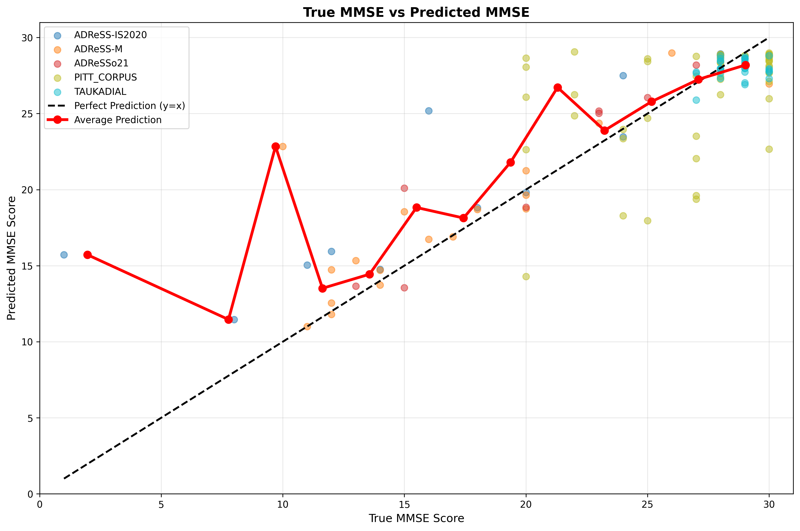
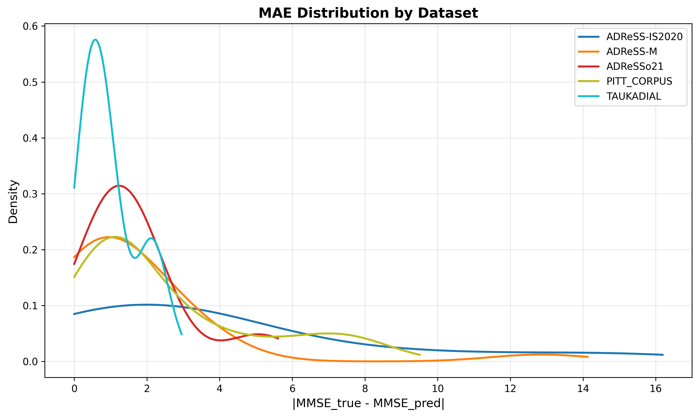
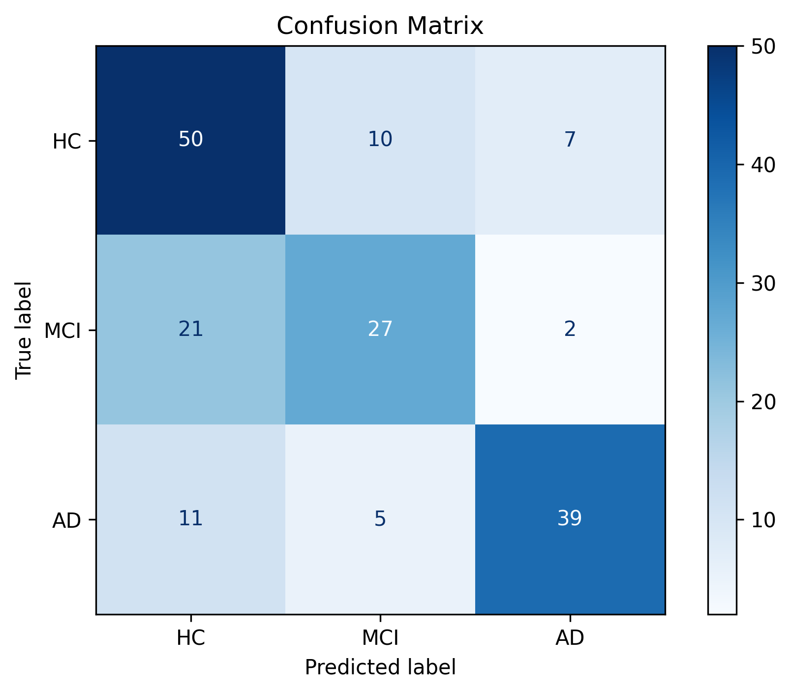
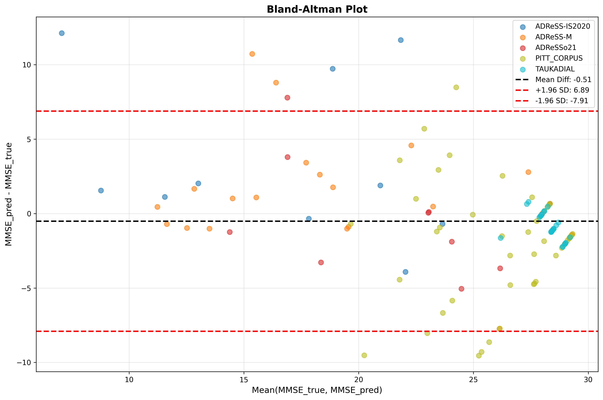

# Neurolens AI

> Multimodal speech intelligence for cognitive assessment from spontaneous spoken responses.


Neurolens AI is a research pipeline that turns raw speech into cognitive predictions.

Given an audio recording and its prompt, the system:
- cleans and normalizes the audio
- transcribes speech with Whisper
- extracts acoustic, linguistic, and LLM-scored semantic features
- generates HuBERT audio embeddings
- fuses everything into a multitask neural network
- predicts both MMSE score and cognitive status (`HC`, `MCI`, `AD`)

## Quick Links

- [How To Use](HOW_TO_USE.md)
- [Feature Inventory](features/FEATURES.md)
- [Evaluation Scripts](eval_scripts/)
- [LLM Semantic Benchmarking](llm_eval/)

## Why This Project Exists

Speech carries cognitive signal at more than one level:
- vocal delivery
- lexical choice
- syntax
- discourse organization
- semantic coherence

Most pipelines lean on only one or two of those.

Neurolens AI is designed to model them jointly so the final predictor has access to both low-level speech behavior and higher-level clinical language structure.

## What Makes It Different

Neurolens AI combines four modalities in one pipeline:
- handcrafted acoustic markers
- handcrafted linguistic markers
- discourse-level semantic ratings from a local LLM
- dense self-supervised speech embeddings

This produces a final feature vector of `1123` dimensions:
- acoustics: `52`
- linguistics: `29`
- semantics: `18`
- HuBERT embeddings: `1024`

## Quick Start

If you already have the local datasets and environment available:

```bash
pip install -r requirements.txt
python -m spacy download en_core_web_sm
python -m spacy download zh_core_web_sm
ollama serve
ollama pull ministral-3:8b
python main.py
python eval_scripts/quick_eval.py
```

For the real workflow, expected directory layout, caches, and evaluation commands, use [HOW_TO_USE.md](HOW_TO_USE.md).

## Pipeline

```text
audio
  -> cleanup
  -> transcription
  -> feature extraction
     -> acoustics (52)
     -> linguistics (29)
     -> semantics (18)
     -> HuBERT embeddings (1024)
  -> feature scaling
  -> multitask model
     -> MMSE regression
     -> cognitive-status classification
```

## Model Overview

The model uses separate encoders for each modality, a shared fused backbone, and two output heads:
- MMSE regression head
- 3-class cognitive-status classification head

Core implementation:
- `processing/cleanup.py`
- `processing/transcriber.py`
- `features/acoustics.py`
- `features/linguistics.py`
- `features/semantics.py`
- `ml/model.py`

## Current Scope

### Tasks

- MMSE regression
- cognitive-status classification: `HC`, `MCI`, `AD`

### Language Support

- English
- Mandarin

### Datasets Used In The Local Workspace

- ADReSS-IS2020
- ADReSS-M
- ADReSSo21
- TAUKADIAL
- Pitt Corpus
- CHOU

## Results

The repository already contains evaluation artifacts under `eval_results/`.

### MMSE Prediction Behavior



This plot shows how predicted MMSE tracks the ground-truth scores across the held-out test set.

### Error Distribution



This visualization shows how absolute error distributes across datasets rather than reporting only one summary metric.

### Classification Output



This is the saved confusion matrix for the diagnosis head on the test split.

### Agreement Analysis



The Bland-Altman plot helps inspect systematic bias and spread between predicted and true MMSE values.

## Repository Layout

```text
features/        handcrafted acoustic, linguistic, and semantic features
processing/      audio cleanup, ASR, and stage-wise batch processing
ml/              augmentation and multitask model code
eval_scripts/    model evaluation and ablation scripts
llm_eval/        semantic-rubric benchmarking against humans and other LLMs
models/          saved weights, scaler, and cached feature matrices
data_jsons/      train/val/test metadata splits
```

## Semantic Layer

The semantic branch is not just embedding-based text scoring.

Neurolens uses a local LLM through Ollama to score clinically motivated discourse features such as:
- semantic memory degradation
- topic maintenance
- confabulation
- logical self-consistency
- executive dysfunction patterns

The default scorer is currently `ministral-3:8b`.

## Documentation

- [HOW_TO_USE.md](HOW_TO_USE.md): setup, environment, datasets, training, outputs, evaluation
- [features/FEATURES.md](features/FEATURES.md): feature definitions and dimensions
- `eval_scripts/`: quick evaluation, ablations, and breakdown analysis
- `llm_eval/`: inter-LLM, intra-LLM, and human agreement analysis for semantic scoring

## Support

If you are trying to run or extend the project:
- start with [HOW_TO_USE.md](HOW_TO_USE.md)
- use the repository issue tracker for broken scripts, setup gaps, or reproducibility issues

## Project Status

This is a research codebase, not a packaged library or production service.

Practical implications:
- local datasets are assumed to exist already
- several stages are optimized around cache reuse, not clean first-run UX
- the core training and evaluation flow is usable
- some utilities in `llm_eval/` are still experimental and need cleanup before broad reuse

## Credits

Concreteness resources used in this repository:

Brysbaert, M., Warriner, A. B., & Kuperman, V. (2014).  
Concreteness ratings for 40 thousand generally known English word lemmas.  
Behavior Research Methods, 46(3), 904-911.

Xu, X., & Li, J. (2020).  
Concreteness/abstractness ratings for two-character Chinese words in MELD-SCH.  
PLoS ONE, 15(6), e0232133.  
https://doi.org/10.1371/journal.pone.0232133
